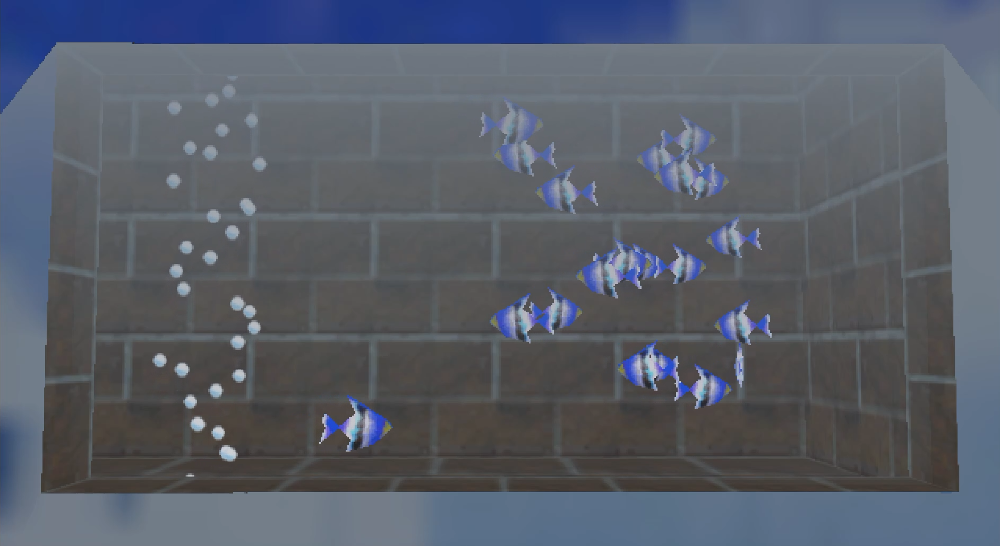

# Aquarium64

Aquarium64 is the reconstruction of one of the aquarium inside the Jolly Roger Bay room in the Peach's Castle proposed as a screen saver.



The project is entirely made with Godot with free assets.


## Installation

### Windows
Go to releases and download the .scr file, drop it inside the System32 folder (administrator permissions required) and then search "screen saver" in the start searchbar or go to control panel and search it there, then finally select it.

### Linux

Linux has no built-in screensaver mechanism like Windows; the standard way to get one is through [XScreenSaver](https://www.jwz.org/xscreensaver/) on an X11 session. The exported project also works fine as a plain fullscreen ambient app.

> **Note:** XScreenSaver only runs on X11 sessions. On Wayland you can still run this as a regular fullscreen app (X11 apps usually work through XWayland).

#### Requirements

- [Godot](https://godotengine.org/) **4.7 or newer** (the project targets Godot 4.7, GL Compatibility renderer)
- XScreenSaver — optional, only if you want it to behave as an actual screensaver

#### Option A — Quick test from the editor

```sh
git clone https://github.com/4ndr34p3rry/Aquarium64
cd Aquarium64
godot --fullscreen
```

#### Option B — Standalone build (any distro)

1. Install Godot 4.7+ and its **Linux export templates**.
2. Export a Linux build, either from the editor (Project → Export → Linux Desktop) or from the terminal:

   ```sh
   godot --headless --export-release "Linux" aquarium64.x86_64
   ```

3. Run it:

   ```sh
   ./aquarium64.x86_64 --fullscreen
   ```

#### Option C — Arch Linux (PKGBUILD)

This repository ships a `PKGBUILD` that builds a standalone binary and bundles a `.desktop` launcher plus an XScreenSaver config example:

```sh
git clone https://github.com/4ndr34p3rry/Aquarium64
cd Aquarium64
makepkg -si        # requires base-devel; pulls godot + export templates at build time
```

This installs `/usr/bin/aquarium64`, an app menu entry and `/usr/share/doc/aquarium64/xscreensaver.conf.example`.

#### Using it as an actual screensaver (XScreenSaver)

1. Install and start XScreenSaver (Arch: `sudo pacman -S xscreensaver`).
2. Add Aquarium64 to the `programs:` list in `~/.xscreensaver` (a commented example is installed with the package):

   ```
   programs:                                                                \
               "Aquarium64"    /usr/bin/aquarium64 --fullscreen    \n\
   ```

3. Restart XScreenSaver and select it from the list:

   ```sh
   xscreensaver-command -restart
   xscreensaver-demo
   ```
